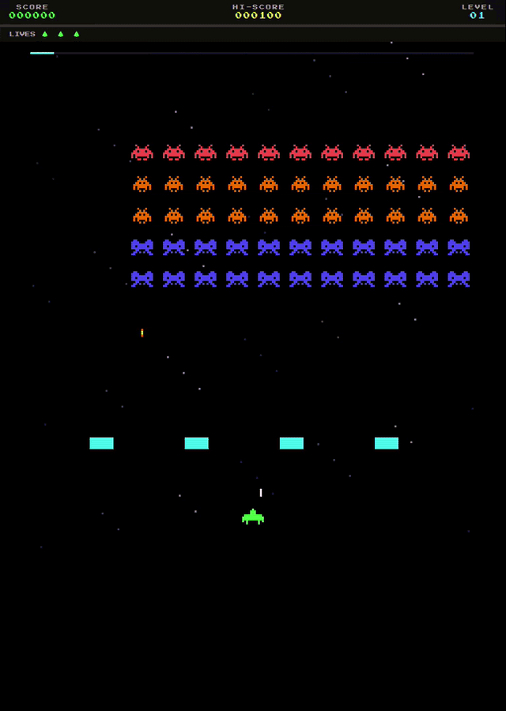

# Space Invaders

**Defenda a Terra. Elimine a invasão. Não deixe nenhum chegar.**



---

## Instalação

### Docker (recomendado — zero configuração)

Requer apenas [Docker Desktop](https://docs.docker.com/get-docker/).

```bash
git clone https://github.com/mfugissecruz/space-invaders-game.git
cd space-invaders-game
docker compose up
```

Abra `http://localhost:8080`. Pronto.

---

### Desenvolvimento local

Requer Node.js 22+ e npm 10+.

```bash
git clone https://github.com/mfugissecruz/space-invaders-game.git
cd space-invaders-game
npm install
npm run dev
```

- Frontend: `http://localhost:5173`
- Backend: `http://localhost:3000`

---

## Arquitetura

```
space-invaders/
├── packages/
│   └── shared/          # @game/shared — tipos TypeScript e constantes compartilhadas
├── server/              # Node.js — motor do jogo, WebSocket, IA do attract mode
├── client/              # Vue 3 + Vite — interface, canvas, HUD, menus
├── docker/
│   ├── Dockerfile       # build multi-stage: builder → server → nginx
│   └── nginx.conf       # serve SPA + proxy WebSocket para o server
└── compose.yml          # orquestra server + nginx com healthcheck
```

### Stack

| Camada | Tecnologia |
|--------|-----------|
| Frontend | Vue 3, Vite, TypeScript, Canvas API |
| Backend | Node.js, ws (WebSocket), Express |
| Tipos compartilhados | `@game/shared` (npm workspace) |
| Validação | Zod (inputs WebSocket) |
| Deploy | Docker multi-stage, nginx |

### Como funciona

O jogo roda **inteiro no servidor**. O `GameEngine` processa toda a lógica (movimento da frota, colisões, tiros, UFO, shields) a cada 60ms via `GameLoop`. O estado é transmitido aos clientes conectados via **WebSocket**. O cliente recebe o `GameState` e apenas renderiza — sem lógica de jogo no browser.

```
Browser                         Server
  │                               │
  │──── WebSocket: input ────────►│
  │                               │  GameLoop tick (60ms)
  │◄─── WebSocket: GameState ─────│  GameEngine.tick()
  │                               │
  │  Canvas renderiza o estado    │
```

---

## Jogabilidade

### Controles

| Tecla | Ação |
|-------|------|
| `←` `→` | Mover nave |
| `Espaço` | Atirar |
| `Enter` | Iniciar / reiniciar |

### Objetivo

Destrua todos os **55 invasores** antes que qualquer um deles alcance a sua nave. Se a frota descer até a linha de perigo — game over imediato, independente das vidas restantes.

### Inimigos

A frota desce em bloco e **acelera** conforme você a diezma. Quanto mais vazia a grade, mais rápidos os sobreviventes.

| Posição na grade | Pontos |
|-----------------|--------|
| Fileira do topo | 30 pts |
| Fileiras do meio | 20 pts |
| Fileiras da base | 10 pts |

O **UFO** aparece no topo da tela de tempos em tempos. Acerte para ganhar bônus aleatório: 50, 100, 150, 200 ou 300 pts.

### Defesas

Quatro **bunkers** protegem sua nave. Cada bloco aguenta **3 acertos** — tanto de tiros inimigos quanto seus. Use como escudo, mas com cuidado.

### Vidas

Você começa com **3 vidas**. Cada tiro de invader que acerta custa uma. Você pode ter no máximo **3 balas suas no ar simultaneamente**.

### Attract Mode

No menu inicial, selecione **Attract Mode** para assistir a uma demonstração automática com IA jogando. Pressione qualquer tecla para voltar ao menu.

---

## Scripts

```bash
npm run dev        # sobe server + client em modo desenvolvimento
npm run build      # compila shared → server → client
npm run typecheck  # verifica tipos em todos os workspaces
```
